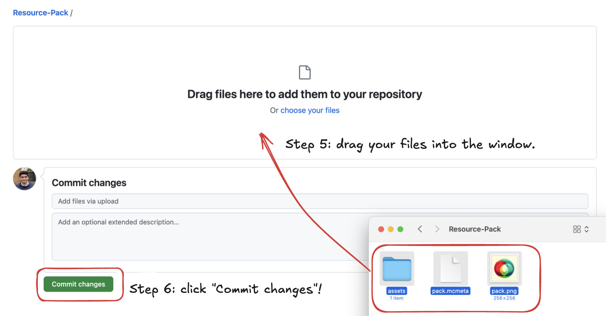

If you already have a pack and just need help with hosting it, skip to [Setting up a GitHub Repository](#setting-up-a-github-repository).

## Understanding the Folder Structure

A Minecraft Resource Pack is essentially a folder which holds a lot of files with your custom textures and resources in them. The below file tree shows how this folder might be organised.

(This is adapted from the Minecraft wiki [page on resource packs](https://minecraft.fandom.com/wiki/Resource_pack#Folder_structure). I have simplified it to omit some paths which are more complex or less relevant for server resource packs.)

```filetree
.
├── pack.mcmeta
├── pack.png
└── assets
    └── minecraft
        ├── sounds
        │   └── custom
        │       ├── metronome.ogg
        │       ├── white_noise.ogg
        │       └── tones
        │           ├── dial.ogg
        │           └── square.ogg
        ├── sounds.json
        └── textures
            ├── block
            │   ├── black_wool.png
            │   └── white_wool.png
            └── entity
                └── zombie
                    └── zombie.png
```

Visually, this looks like:


We'll go over each of these in more detail individually later on.

## Creating Your Resource Pack

To create your resource pack, start by creating a new folder. This folder will serve as the root directory for your resource pack. Alternatively, you can download my example resource pack as a template:

<p><a href="https://github.com/AK1089/Example-Resource-Pack/archive/refs/heads/main.zip" download class="file-download"><br /> <svg>
    <use href="/assets/icons/sprite.svg#document"></use>
</svg><br /> <span data-filename="Example-Pack.zip"></span><br /></a></p>

If you're not using my example pack, create the following files and folders inside the root folder:

- `pack.mcmeta`: This file contains some important metadata about your resource pack: we'll get to it later.
- `pack.png`: This is the icon for your resource pack that displays in the Resource Pack Selection screen.
- `assets` folder: This folder will contain all the custom textures, sounds, and fonts for your resource pack.

Inside the `assets` folder, create a `minecraft` subfolder, and inside it create the subfolders:

- `font`: If you want a custom font in your pack, otherwise ignore this.
- `textures`: If you want to edit the visual appearance / texture of any block, entity, item, or anything else in the game.
- `sounds`: If you want to edit or add any sounds in the game. If you include this, make sure to also add a `sounds.json` file.

## Structuring Pack Meta Files

The `pack.mcmeta` file is a JSON file that provides information about your resource pack. Inside it, paste the following text:

```json
{
  "pack": {
    "pack_format": 42,
    "description": "Your resource pack description goes here"
  }
}
```

Pack format 42 is valid for Minecraft version 1.21.3. To check the most recent version, you can see the [Minecraft wiki](https://minecraft.fandom.com/wiki/Pack_format#Resources) page on pack formats.

In the description field, add the description you want to be visible in the Resource Pack Selection screen. Note that this is displayed over two lines, and cut off if it is too long.

The `pack.png` file is an optional PNG image that will be displayed as the icon for your resource pack in the selection screen. This should ideally be a small square image. If you don't include this image, the icon for your resource pack will be greyed out.

## Adding Textures

To add custom textures to your resource pack, navigate to `assets/minecraft/textures`. In here, you can create subfolders for the different texture categories, such as `block`, `entity`, `item`, and `painting`.

Place your custom texture files (which should be PNG images) inside the respective subfolders. For example, if you have a custom texture for spruce planks, place it inside the `block` folder and name it `spruce_planks.png`.

The example pack I provided has some examples:

- `/textures/block/black_wool.png`: retextures black wool to be pure black
- `/textures/block/white_wool.png`: retextures white wool to be pure white
- `/textures/entity/zombie/zombie.png`: retextures the Zombie to look ghostlike

## Adding Fonts

To add custom fonts to your resource pack, create a `font` folder inside the `assets/minecraft` folder. Place your custom font file (in TTF or OTF format) inside the font subfolder. Suppose you want 

Then, create a file named (for example) `courier.json`. Inside it, specify your font, in the format

```json
{
    "providers": [
        {
            "type": "ttf",
            "file": "minecraft:courier.ttf"
        }
    ]
}
```

Replace `courier.ttf` with your filename.

When you want to display text in this new font, you can use

```msc
@bypass /tellraw @s {"text": "This is a custom font!", "font": "courier"}
```

to control the display.

## Adding Sounds

To add custom sounds to your resource pack, create a `sounds` folder inside the `assets/minecraft` folder to store all your `.ogg` files. You can organise sounds however you want in here, including in subfolders. In my example pack, the sounds directory is structured as:

```tree
assets/minecraft
├── sounds.json
└── sounds
    └── custom
        ├── metronome.ogg
        ├── white_noise.ogg
        └── tones
            ├── dial.ogg
            └── square.ogg
```

Then, in `assets/minecraft/sounds.json`, add the following text (for example):
```json
{
    "block.lever.click": {
        "sounds": [
            {
                "name": "custom\/metronome",
                "volume": 1.00
            }
        ],
        "replace": true
    },
    "custom.tone": {
        "sounds": [
            {
                "name": "custom\/tones\/dial",
                "volume": 1.00
            },
            {
                "name": "custom\/tones\/square",
                "volume": 1.00
            }
        ],
        "replace": true
    }
}
```

Edit this accordingly to match all of your files. This follows a simple pattern: For each sound, we have:

- `"sound.resource.location":` (this is the name of the sound path you use in a `/playsound` command)
- `"sounds":` (followed by a list of sound files)
- `"name": "path\/to\/sound_file"` (using backslashes before each slash)
- `"replace": true` (so the game uses these sound files)

Note that the in-game sound events, like `block.lever.click`, will trigger as usual with your new sound files (here, when you toggle a lever). However, you can also use new paths like `custom.tone`, which will *only* trigger when you use `/playsound`.

<h2 id="setting-up-a-github-repository">Setting up a GitHub Repository</h2>

We'll be using GitHub to host our pack: if you don't have an account, sign up [here](https://github.com/signup). Click [here](https://github.com/new) to create a new GitHub repository.




- Add your repository name in the `Repository name` field: this should be the name of your resource pack. For server resource packs, the name isn't super important: I would recommend simply entering your map's name.
- Make sure "Public" is selected, and click "Create repository".
- Click on the blue "uploading an existing file" link.
- Navigate to a Finder (Mac) / File Explorer (Windows) window and open your resource pack folder. You should be able to see `assets`, `pack.mcmeta`, and `pack.png`, Drag and drop it into the main part of the GitHub browser window.
- Wait for everything to finish uploading, then scroll down and click the big green button which says "Commit changes".

Your files are now stored online!

## Setting up a Server Resource Pack

Now, it's time to set up your command. Enter the details of your map and repository here:

GitHub username: <input type="text" id="ghusername" placeholder="AK1089">

Repository name: <input type="text" id="ghreponame" placeholder="Example-Resource-Pack">

Map code: <input type="text" id="mapCode" placeholder="xyz">

<div id="userDownloadArea" style="display: none;">
<p>Now, test the link by downloading a zipped version of your resource pack from here:</p>
<a id="userDownload" href="https://github.com/AK1089/Example-Resource-Pack/archive/refs/heads/main.zip" download class="file-download"><br /> <svg>
    <use href="/assets/icons/sprite.svg#document"></use>
</svg><br /> <span id="userFilename" data-filename="Your-Pack.zip"></span><br /></a>
</div>

<div id="dropZoneArea" style="display: none;">
<p>If this takes you to a "Not found" page, double-check the details you entered. Otherwise, you should have a <code>.zip</code> file. Drag and drop it here:</p>
<div class="drop-zone" id="dropZone">
    <p class="primary-text">Drag and drop a file here</p>
    <p class="secondary-text">or click to select a file</p>
</div>
</div>

<input type="file" id="fileInput">

<div id="resultArea" style="display: none;">
<p>Now, copy the command below and give it to an admin:</p>
<pre data-language="command"><button class="copy-button" onclick="copyCode(this)" aria-label="Copy code to clipboard"><svg class="icon icon--stroke" width="24" height="24"><use href="/assets/icons/sprite.svg#copy"></use></svg></button><code id="result" class="language-command"><span><div id="hashOutput"></div></span></code></pre>
</div>

<link rel="stylesheet" href="styles.css" />
<script src="script.js"></script>